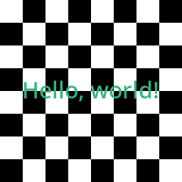

# Wave Function Collapse

Trying to recreate the following: [link](https://youtu.be/rI_y2GAlQFM).

But first learning how to use CairoGraphics, and Meson/Ninja.

# Implemented utilites
## `draw_chessboard()`
Generates a chessboard pattern with `Hello, World!` on the middle.

## `draw_tiles()`

Generates a tile-set of the tiles from the given folder.

Example with the [circuit](img/test_tiles/circuit/) tile-set:

## `draw_random_tiles()`

Generates a random tile-set for the given folder, and optionally, given size. Each tile is selected randomlly and then randomlly rotated &pi halves.

Example with the [circuit](img/test_tiles/circuit/) tile-set:

